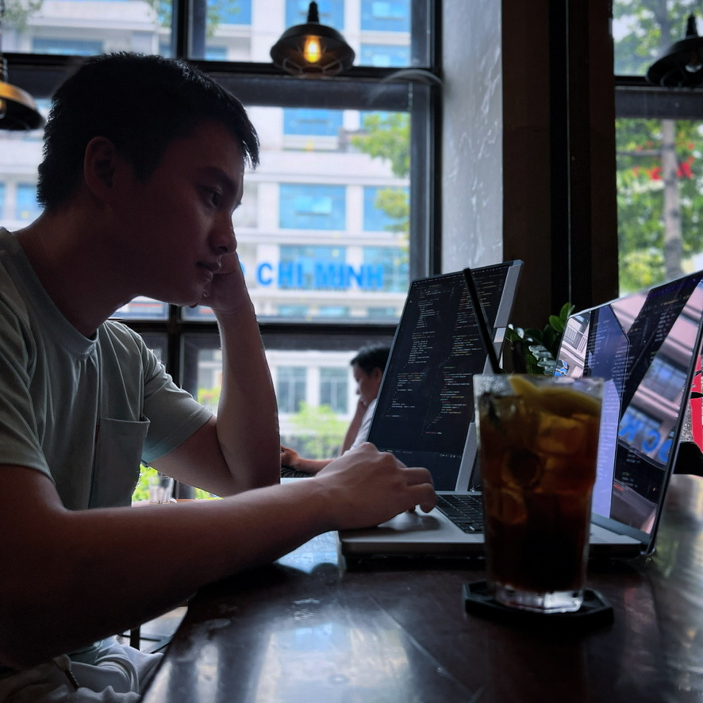

# Hi there, I'm Phillip Nguy - [Portfolio][website] 👋

  

---

## I'm a Developer, Traveler, Photographer, and Environmentalist!!

- 🌊 I am a full developer with a background in design and environmental science 🌱
- 🇯🇵 One of my dreams is to live abroad in Japan and work remotely 🍣
- 📷 I love anime, photography, and volleyball 🏐
- 2022 Goals: Make a mobile app with Tensorflow, SQL 📖
- I can speak Vietnamese 🇻🇳 I also want to practice more Japanese！🇯🇵

---

### Languages and Tools:

 
 

---

### Social Media:
<a href="https://www.instagram.com/xforgetfulphilx/" target="blank">
<a href="https://linkedin.com/in/phillipnguy" target="blank">

 
 

---

 
 

---

### :zap: Recent GitHub Activity

<!--START_SECTION:activity-->
1. 🎉 Merged PR [#1](https://github.com/PhillipNguy/portfolioV2/pull/1) in [PhillipNguy/portfolioV2](https://github.com/PhillipNguy/portfolioV2)
2. 💪 Opened PR [#1](https://github.com/PhillipNguy/portfolioV2/pull/1) in [PhillipNguy/portfolioV2](https://github.com/PhillipNguy/portfolioV2)
<!--END_SECTION:activity-->

<!--
[website]: https://PhillipNguy.com
[instagram]: https://instagram.com/xForgetfulPhilx
[linkedin]: https://linkedin.com/in/PhillipNguy -->
